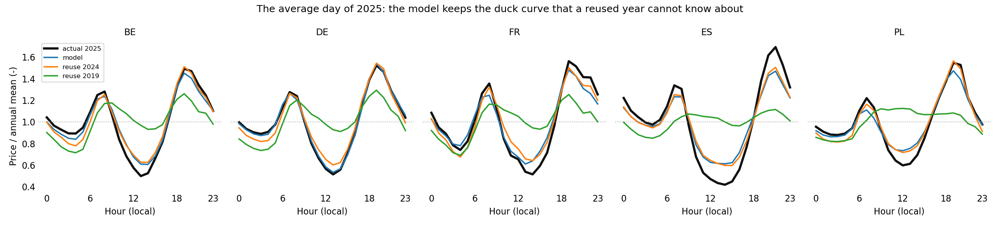

# pricecast

**Synthetic hourly electricity price years for prospective energy system studies.**

`pricecast` generates a full year of hourly day-ahead prices in one shot from
three physical drivers - load, solar and wind generation - with a regression
fitted on recent years. It is an *input* to LP and MILP design studies, not a
forecaster: the shape of the year comes from the model, the level from an
outside fuel-and-carbon scenario.

- [Usage](usage.md): fitting, generating, checking a year's structure.
- [Recipe](recipe.md): building a future year from a scenario, step by step,
  with the sources for each input.
- [Mathematics](mathematics.md): the model, the residual process, the level
  anchor and the floor, with every symbol defined.

